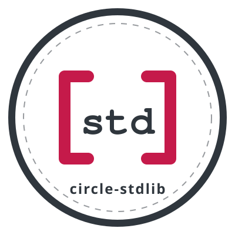

# circle-stdlib

[](https://github.com/smuehlst/circle-stdlib/actions/workflows/smoketest-libcxx.yaml)
[](https://github.com/smuehlst/circle-stdlib/actions/workflows/smoketest-clang.yaml)
[](https://github.com/smuehlst/circle-stdlib/issues)
[](https://github.com/smuehlst/circle-stdlib/pulls)



## Project Home

This project is hosted on GitHub:

https://github.com/smuehlst/circle-stdlib

## Overview

This project provides C and C++ standard library support for the
Raspberry Pi bare-metal environment [Circle](https://github.com/rsta2/circle).

[Newlib](https://sourceware.org/newlib/) is used as the standard C library. The fork
[circle-newlib](https://github.com/smuehlst/circle-newlib) contains the changes for
building Newlib in combination with Circle.

Historically C++ standard library support in circle-stdlib was provided by using
[libstdc++](https://gcc.gnu.org/onlinedocs/libstdc++/) as-is from the ARM GNU
toolchain. Things like containers and algorithms just worked because they
are platform-independent. However all platform-dependent parts of the C++
standard library did not work with that approach.

Starting with v20 circle-stdlib implements the option to build circle-stdlib
with [libc++](https://libcxx.llvm.org/) and with clang/clang++
from the [LLVM project](https://llvm.org/). The platform-dependent parts of 
libc++ are built on top of Circle's corresponding classes.

There is a fork of the [GitHub llvm-project repository](https://github.com/llvm/llvm-project)
at [llvm-project](https://github.com/smuehlst/llvm-project). This contains minor
changes for building the `libc++` library in the context of circle-stdlib.

With libc++ comes support in the C++ standard library for:

* `std::thread` (with Circle's cooperative and non-preemptive scheduler)
* `std::mutex`
* `std::condition_variable`
* `std::filesystem`
* `thread_local` storage class
* `std::random_device` (based on Circle's class for accessing the hardware RNG)

Using libc++ is currently experimental and optional. It may become the default
in the future.

It is also possible to build the complete project with LLVM's clang and clang++
compilers (`configure` options `--clang` in combination with `--libcxx`).
This build does not use gcc at all, neither the
compiler nor the runtime libraries. Note that the restrictions mentioned in
[Circle's readme about clang support](https://github.com/rsta2/circle/blob/develop/doc/clang-support.txt)
apply. Circle and circle-stdlib built with LLVM compilers are not tested as
thoroughly as the gcc builds.

[mbed TLS](https://tls.mbed.org/) can optionally be used for TLS connections in
Circle (call configure with `--opt-tls`, see also the
[README file for circle-mbedtls](circle-mbedtls.md)).

## Getting Started

### Prerequisites

A gcc 15.2.Rel1 toolchain from [Arm GNU Toolchain Downloads](https://developer.arm.com/downloads/-/arm-gnu-toolchain-downloads):

* Hosted on Intel Linux:
  * [AArch32 bare-metal target (arm-none-eabi)](https://developer.arm.com/-/media/Files/downloads/gnu/15.2.rel1/binrel/arm-gnu-toolchain-15.2.rel1-x86_64-arm-none-eabi.tar.xz)
  * [AArch64 ELF bare-metal target (aarch64-none-elf)](https://developer.arm.com/-/media/Files/downloads/gnu/15.2.rel1/binrel/arm-gnu-toolchain-15.2.rel1-x86_64-aarch64-none-elf.tar.xz)
* Hosted on AArch64 Linux:
  * [AArch32 bare-metal target (arm-none-eabi)](https://developer.arm.com/-/media/Files/downloads/gnu/15.2.rel1/binrel/arm-gnu-toolchain-15.2.rel1-aarch64-arm-none-eabi.tar.xz)
  * [AArch64 ELF bare-metal target (aarch64-none-elf)](https://developer.arm.com/-/media/Files/downloads/gnu/15.2.rel1/binrel/arm-gnu-toolchain-15.2.rel1-aarch64-aarch64-none-elf.tar.xz)

Alternatively an [LLVM 22.1.4](https://github.com/llvm/llvm-project/releases/tag/llvmorg-22.1.4) clang/clang++ toolchain from [llvm-project releases](https://github.com/llvm/llvm-project/releases):

* Hosted on Intel Linux: [Linux x86_64](https://github.com/llvm/llvm-project/releases/download/llvmorg-22.1.4/LLVM-22.1.4-Linux-X64.tar.xz)
* Hosted on AArch64 Linux: [Linux Arm64](https://github.com/llvm/llvm-project/releases/download/llvmorg-22.1.4/LLVM-22.1.4-Linux-ARM64.tar.xz)

### Building the Libraries

Add the toolchain to the path, then:

```bash
git clone --recursive https://github.com/smuehlst/circle-stdlib.git
cd circle-stdlib
./configure
make
```

This configures the build for the default 32-bit toolchain with the `arm-none-eabi-` prefix.

The `configure` script has the following options:

```bash
$ ./configure -h
usage: configure [ <option> ... ]
Configure Circle with newlib standard C library
Optional: libc++ standard C++ library and mbed TLS library

Options:
  -d, --debug                    build with debug information, without optimizer
  -h, --help                     show usage message
  -k, --kasan                    build with Kernel Address Sanitizer support
  -n, --no-cpp                   do not support C++ standard library
  -o, --option <name>[=<value>]  additional preprocessor define (optionally with value)
                                 can be repeated
  --opt-tls                      build with mbed TLS support
  -p <string>, --prefix <string> prefix of the toolchain commands (default: arm-none-eabi-)
  --qemu                         build for running under QEMU in semihosting mode
  --kernel-max-size <megabytes>
                                 Set maximum size of the kernel image (default: 4)
  -r <number>, --raspberrypi <number>
                                 Circle Raspberry Pi model number (1, 2, 3, 4, 5, default: 1)
  --softfp                       use float ABI setting "softfp" instead of "hard"
  -s <path>, --stddefpath <path>
                                 path where stddef.h header is located (only necessary
                                 if configure cannot determine it automatically)
  --libcxx                       build with LLVM libc++ (fetched automatically)
  --libcxx-repo                  build with LLVM libc++ using a manually checked-out
                                 llvm-project repository at libs/llvm-project
  --clang                        build with LLVM clang/clang++ instead of GCC
                                 (requires --libcxx or --libcxx-repo)
  --aarch64                      target AArch64 (required with --clang for 64-bit builds)
```

To clean the project directory, the following commands can be used:

```bash
make clean
make mrproper   # removes the configuration too
```

### Building the Samples

```bash
make build-samples
```

### Running and Debugging the Programs

The resulting executables are normal Circle bare-metal applications. Circle's
standard [installation](https://github.com/rsta2/circle#installation) 
and [debugging](https://github.com/rsta2/circle/blob/master/doc/debug.txt)
instructions apply.

For running the programs under QEMU see Circle's corresponding
[notes on QEMU](https://github.com/rsta2/circle/blob/master/doc/qemu.txt).

## Posix Socket Support

There is experimental support for the Posix socket interface. More details
are available in [SOCKETS.md](doc/SOCKETS.md).

## Release History

See [CHANGELOG.md](CHANGELOG.md).

## License

This project is licensed under the GNU GENERAL PUBLIC LICENSE
Version 3 - see the [LICENSE](LICENSE) file for details

## Acknowledgements

* Rene Stange for [Circle](https://github.com/rsta2/circle).
* The Newlib team for [Newlib](https://sourceware.org/newlib/).
* The gcc team for [gcc](https://gcc.gnu.org/).
* The LLVM team for [libc++](https://libcxx.llvm.org/) and [Clang](https://clang.llvm.org/).
* The mbed TLS team for [mbed TLS](https://tls.mbed.org/).
* The [Mongoose web server library](https://mongoose.ws/).
* The [nlohmann/json](https://github.com/nlohmann/json) library.
* The [doctest](https://github.com/doctest/doctest) C++ testing framework.